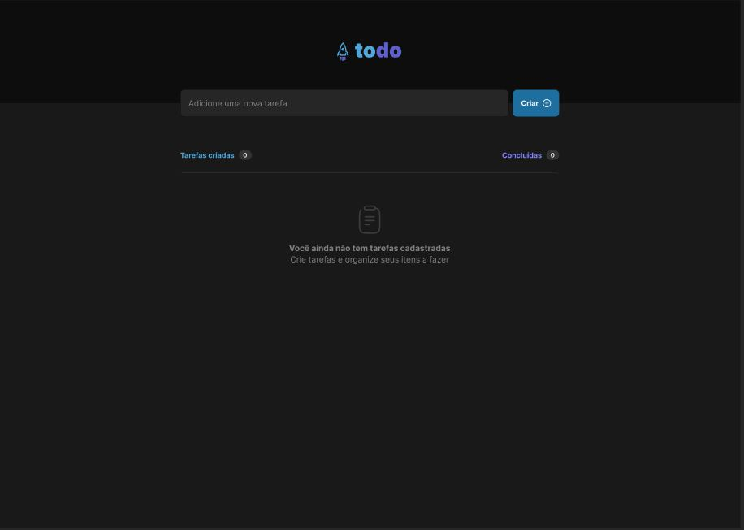

# ToDo List JavaScript

O aplicativo foi construído utilizando HTML, CSS e JavaScript. Ele permite que os usuários criem e gerenciem uma lista de tarefas, marquem tarefas como concluídas e acompanhem seu progresso.

## Recursos

- **Criação de Tarefas:** Os usuários podem inserir uma tarefa e adicioná-la à lista de tarefas clicando no botão "Criar" ou pressionando Enter.

- **Conclusão de Tarefas:** Cada tarefa possui uma caixa de seleção ao lado dela, e os usuários podem marcar uma tarefa como concluída clicando na caixa de seleção. A tarefa concluída será visualmente distinguida das tarefas não concluídas.

- **Exclusão de Tarefas:** Os usuários podem excluir uma tarefa clicando no ícone da lixeira ao lado dela.

- **Contadores de Tarefas:** O aplicativo mantém o controle do número total de tarefas criadas e do número de tarefas concluídas. Esses contadores são exibidos na parte superior da lista de tarefas.

- **Estado Vazio:** Quando nenhuma tarefa é criada, uma mensagem informativa é exibida para incentivar os usuários a começarem a adicionar tarefas.

## Estrutura de Arquivos

- `index.html`: O arquivo HTML principal que define a estrutura da página web e inclui ativos e scripts necessários.

- `style/Style.css`: O arquivo CSS que define o estilo da página web.

- `assets/`: Esta pasta contém vários recursos, incluindo ícones e imagens usados no aplicativo.

- `script/script.js`: O arquivo JavaScript que contém a lógica para criar, gerenciar e atualizar tarefas na lista de tarefas.

## Como Usar

1. abra a [pagina](https://js-todolist-j0aocunha.netlify.app/)

2. Você pode começar inserindo uma tarefa no campo de entrada e clicando no botão "Criar" ou pressionando Enter.

3. À medida que você completa ou exclui tarefas, os contadores serão atualizados para refletir o estado atual de sua lista de tarefas.

---

## Inspiração

